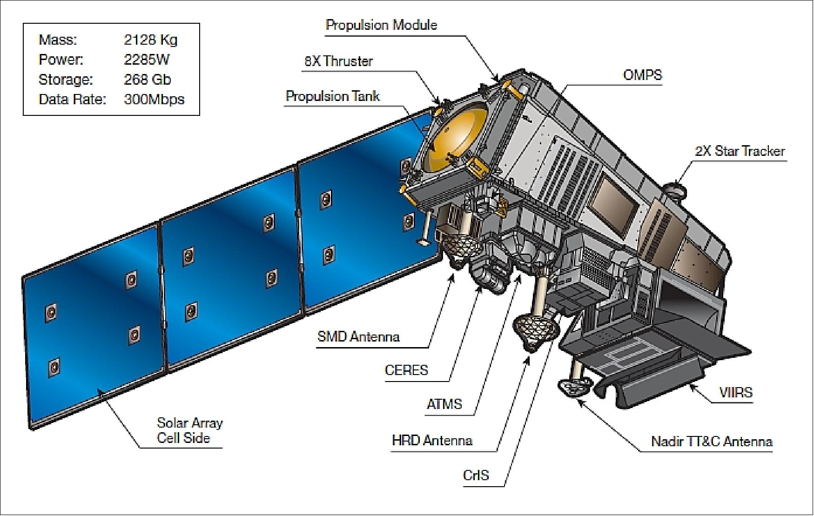

---
# What is Suomi NPP?

--
## Let's check the summary of Suomi NPP

--
### hint: it looks like this 
```{r echo=FALSE, out.width='50%', fig.align='center'}

```

source: [*Suomi NPP*](https://www.eoportal.org/satellite-missions/suomi-npp#spacecraft)

---
## Summary - General Information
- [**Suomi National Polar-orbiting Partnership (Suomi NPP)**](https://www.eoportal.org/satellite-missions/suomi-npp#summary) is a weather satellite operated by the U.S. National Oceanic and Atmospheric Administration (NOAA) that was launched on 28 October 2011 **Citation**. 

- Suomi NPP is the result of a **partnership between NASA, NOAA and DoD (**CITATION**)

- it was initially used as pathfinder fro bigger mission National Polar-orbiting Operational Environmental Satellite System (NPOESS), Then the program continue as weather forecaster replacing NPOESS and US Defense Meteorological Satellite Program (DMSP).

- Suomi NPP operates in **sun-synchronous** orbit from **824km** above the earth. Suomi NPP has **orbital period 101 minutes** so it pass over the earth twice per day

- Suomi NPP will end on 01 October 2026

---
## Summary - Instrument 

.panelset[
.panel[.panel-name[**General**]
.pull-left[
- Suomi NPP has 5 different instruments with different function, which are:
    1. ATMS
    
    1. VIIRS
    
    1. CrLS
    
    1. OMPS
    
    1. CERES
]

.pull-right[
```{r echo=FALSE, out.width='100%', fig.align='center'}

```

Suomi-NPP Instrument Configuration
<br>
Source: [Suomi-NPP Configuration](https://www.eoportal.org/satellite-missions/suomi-npp#spacecraft)

]


]

.panel[.panel-name[**ATMS**]
- ATMS is Advanced Technology Microwave Sounder 

- is a cross-track microwave radiometer

- used to detect temperature and humidity

- give 22 measurement channels

- swath width 2300 km

- spatial resolution 1.5 km
]

.panel[.panel-name[**VIIRS**]
- VIIRS is Visible/Infrared Imager and Radiometer Suite or multi-spectral radiometer

- used to observe land, ocean, and atmospheric parameters which beneficial to see human activity and energy behaviour in the city, tracking burning of waste natural gas (gas flares) on off shore production sites

- collect data in 22 spectral bands, varying between visible near infrared (VNIR) and thermal infrared (TIR) spectral ranges

- swath width 3000km

- spatial resolution: 400m to 800m

- wavelengths: 0.41 to 12.5um (citation: Suomi NPP VIIRS on-orbit performance, data quality, and new applications

- VIIRS collects nighttime imagery data or Day/night Band (DNB) that capture low-light emission sources on the earth and atmosphere surface. 
]

.panel[.panel-name[**CrIS**]
- Cross-track Infrared Sounder (CrIS) is a high-resolution infrared sounder 

- used to profile earth's atmosphere

- swath width 2300 km

- spatial resolution: 14 km

- collects 1300spectral band across infrared region
]

.panel[.panel-name[**OMPS**]
- Ozone Mapping and Profiler Suite (OMPS) is an ultraviolet imaging spectometer

- have a purpose to measure ozon concentration variation and ozone level in the atmosphere

- utilies three spectrometers which are 2 nadir sensors and 1 limb sensor
]

.panel[.panel-name[**CERES**]
- Cloud and the Earth’s Radiant Energy System (CERES) is used to measure Earth-reflected solar and Earth-emitted thermal radiation.

- utilising three spectral channels

- spatial resolution: 20 km
]
]


---
class: inverse center middle
# But, what we can do with collected data by Suomi NPP?

--

## Let's check applications of Suomi NPP data

---

## Application 01 - Fire Phase Detector

- VIIRS on suomi NPP satellite are sensitive to visible light from flaming fires (**citation: Detecting**) which allows  to differentiate phase of wild fire, such as flaming or smoldering. This is beneficial for peatland that is prone to fire combustion

- (**Citation**) detects fire burning phase using VIIRS DNB and M-band to calculate visible energy fraction (VEF) as indicator of fire combustion phase.

- Image on the right show intensity mapping of fire on 2018 California campfire as the case study of this paper


.pull-left[
```{r echo=FALSE, out.width='100%', fig.align='right'}

```
]
.pull-right[
source: **citation**
]


---
## Application 02 - Near-real time Flood Detector
.pull-left[
- Suomi NPP have shorter revisit period compare to SAR, landsat, or sentinel which is make it better to provide near-real time data. This characteristic can be a good advantage if it is applied to handle natural disaster which require a fast respond. 

- NOAA has developed near-real time flood detector software called [VIIRS NOAA GMU Flood (VNGF) Version 1.0](https://cimss.ssec.wisc.edu/cspp/viirs_flood_v1.0.shtml) using Suomi NPP VIIRS band 1,2,3, and 5 data to detect water and M-band to specify cloud cover (**Citation: Automatic**). 

- The result, flooding map, are really beneficial to handle flooding and formulate mitigation plan. 

- However, VIIRS medium spatial resolution hinders from observing specific area in microscale. 
]

.pull-right[
```{r echo=FALSE, out.width='100%', fig.align='right'}

```

Flow chart of VNGF
source: **Citation**

]
---
class: inverse center middle
# So, what we get from learning about Suomi NPP?

--

## Let's check reflection part

---

## Reflection
- Suomi NPP is a really beneficial satellite because it carries 5 instruments that have different functions which allows applying various analysis using the collected data

- The short revisit period allows to get day and night imagery and realtime data set.

- It is really beneficial especially for natural disaster or hazard mitigation such as floods and fire combusation. 

- Its has constant resolution compare to its predecessor, DMSP. Thus it will give a better accuracy on the analysis

- However, its spatial resolution is medium which does not allow to analysis small or specific area in the city. 

- Moreover, the data processing software of suomi NPP is still evolving, thus it is a challange on the consistancy of the data (citation: Suomi NPP VIIRS on-orbit performance, data quality, and new applications). 
---
## Reference
